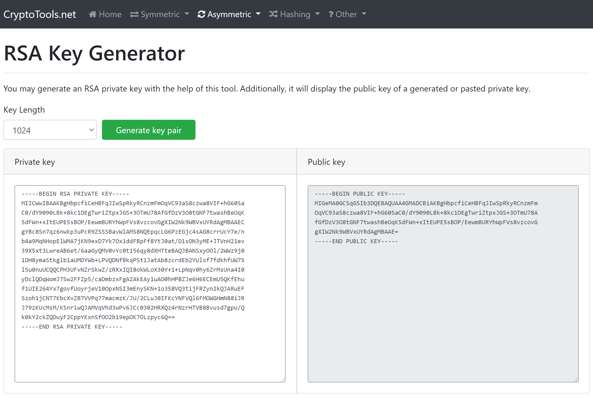
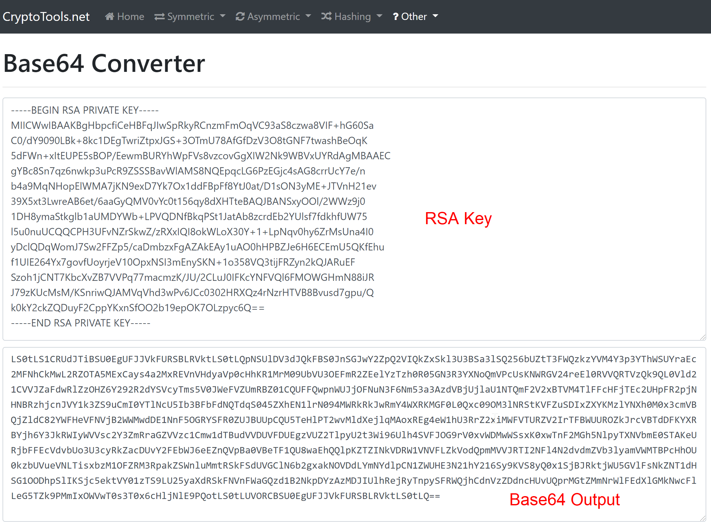
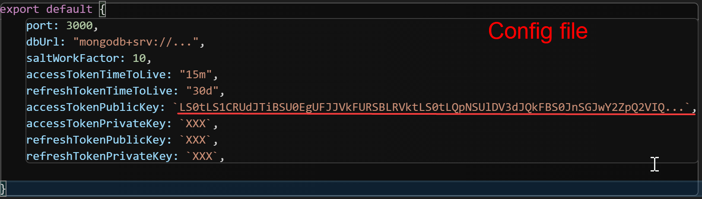

# Rest API v2 - TypeScript Edition

New Rest API for the "This is IT" project written in typescript.

## Requirements

- [node + npm](https://nodejs.org/en/)
- [git](https://git-scm.com/)
- [mongodb server](https://www.mongodb.com/)

## Installation

- `git clone https://github.com/herodev1337/this_is_it.git`
- `cd this_is_it/server/`
- `npm install`
- Copy config/default.example to config/default.ts and edit accordingly
- `npm run dev`

## Configuration

The configuration file offers a simple way to configure the Rest API.

``` typescript
export default {
    port: 3000, // Port that the app uses
    dbUrl: "mongodb+srv://...", // The mongodb server connection url
    saltWorkFactor: 10, // How many rounds (more rounds, more time) are needed to calc the hash
    accessTokenTimeToLive: "15m", // How long the accessToken lives
    refreshTokenTimeToLive: "30d", // How long the refreshToken lives
    // All keys have to be RS256 (RSA Signature with SHA-256) encoded as base64
    accessTokenPublicKey: `BASE64 RS256`,
    accessTokenPrivateKey: `BASE64 RS256`,
    refreshTokenPublicKey: `BASE64 RS256`,
    refreshTokenPrivateKey: `BASE64 RS256`, 
}
```

## Creating the public and private keys
When using in production, it is advised to create the keys on your local machine. These instructions are for running a <b>development instance ONLY</b>! 

1. Go to https://cryptotools.net/rsagen and select your key length (1024 is enough for development)
2. Generate a key pair
3. Go to https://cryptotools.net/base64 and encode the keys into base64
4. Put the base64 string into the configuration
5. Repeat for every key


<br>
<br>


## Postman Collection

For API testing download the [Postman collection file](api.postman_collection.json) and import it.
Also import the [Postman environment file](api.postman_environment.json) for an quick start in testing the API